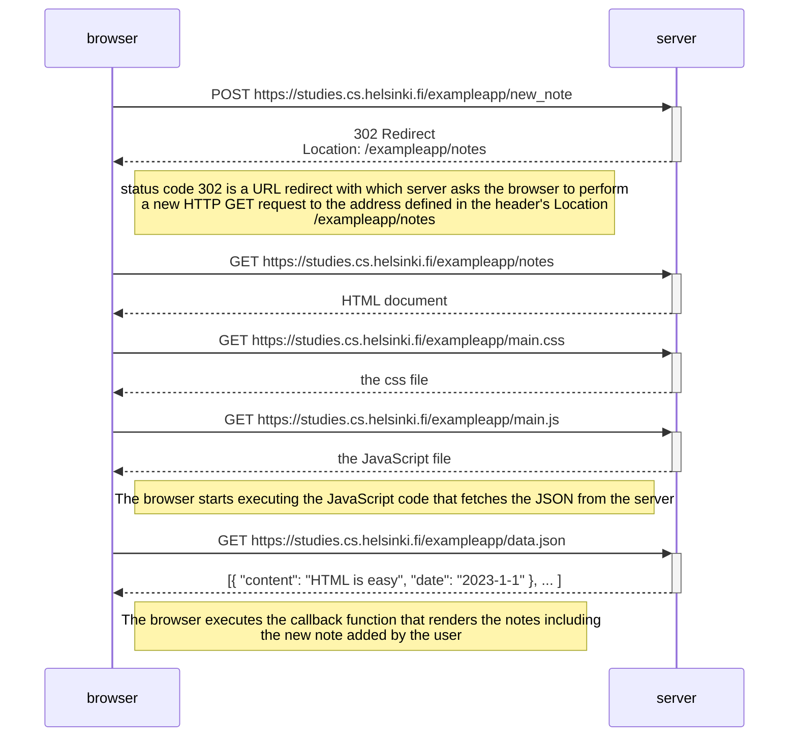

```mermaid
sequenceDiagram
participant browser
participant server

    browser->>+server: POST https://studies.cs.helsinki.fi/exampleapp/new_note

    server-->>-browser: 302 Redirect <br/> Location: /exampleapp/notes

    Note right of browser: status code 302 is a URL redirect with which server asks the browser to perform <br/> a new HTTP GET request to the address defined in the header's Location <br/> /exampleapp/notes


    browser->>+server: GET https://studies.cs.helsinki.fi/exampleapp/notes

    server-->>-browser: HTML document


    browser->>+server: GET https://studies.cs.helsinki.fi/exampleapp/main.css

    server-->>-browser: the css file


    browser->>+server: GET https://studies.cs.helsinki.fi/exampleapp/main.js

    server-->>-browser: the JavaScript file


    Note right of browser: The browser starts executing the JavaScript code that fetches the JSON from the server

    browser->>+server: GET https://studies.cs.helsinki.fi/exampleapp/data.json

    server-->>-browser: [{ "content": "HTML is easy", "date": "2023-1-1" }, ... ]


    Note right of browser: The browser executes the callback function that renders the notes including <br/> the new note added by the user
```
