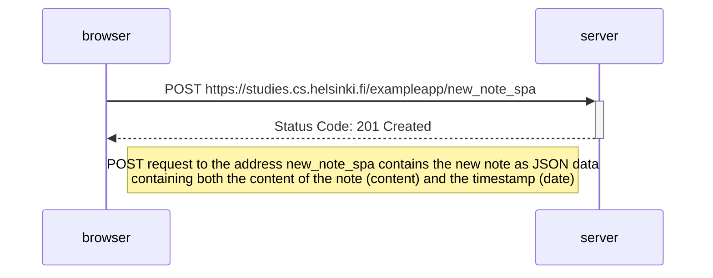

```mermaid

sequenceDiagram
    participant browser
    participant server

    browser->>+server: POST https://studies.cs.helsinki.fi/exampleapp/new_note_spa

    server-->>-browser: Status Code: 201 Created

    Note right of browser: POST request to the address new_note_spa  contains the new note as JSON data <br/> containing both the content of the note (content) and the timestamp (date)


```
